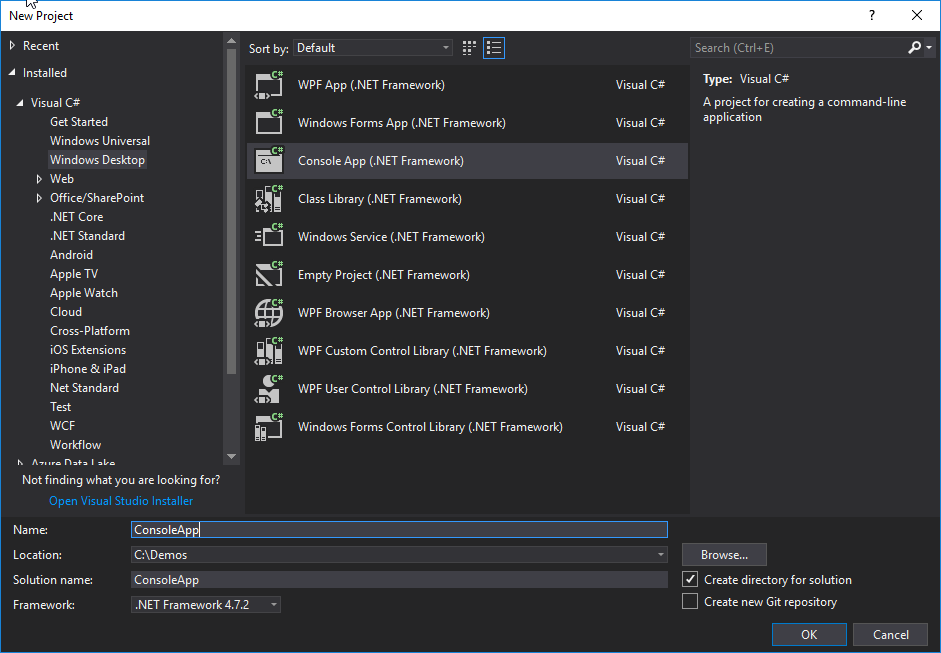
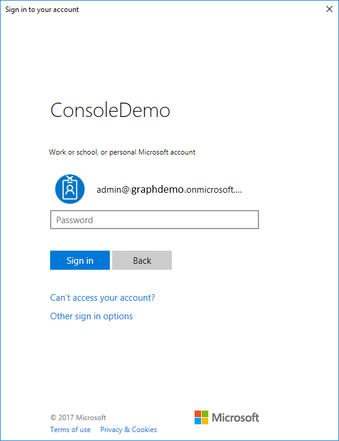

# Build a .NET console application using Microsoft Graph

In this demo you will create a .NET console application from scratch using .NET Framework 4.7.2, the Microsoft Graph SDK, and the Microsoft Authentication Library (MSAL).

## Register the application 
 
1. Navigate to the [the Azure portal - App registrations](https://go.microsoft.com/fwlink/?linkid=2083908) to register your app. Login using a **personal account** (aka: Microsoft Account) or **Work or School Account**.

1. Select **New registration**. On the **Register an application** page, set the values as follows.

* Set **Name** to **ConsoleDemo**.
* Set **Supported account types** to **Accounts in any organizational directory and personal Microsoft accounts**.
* Leave **Redirect URI** empty.
* Choose **Register**.

1. On the **ConsoleDemo** page, copy the values of both the **Application (client) ID** and the **Directory (tenant) ID**. Save these two values, since you will need them later.

1. Select the **Add a Redirect URI** link. On the **Redirect URIs** page, locate the **Suggested Redirect URIs for public clients (mobile, desktop)** section. Select the URI that begins with `msal` **and** the **urn:ietf:wg:oauth:2.0:oob** URI. 

1. Open the sample solution in Visual Studio and then open the **App.config** file. Change the **clientId** string to the **Application (client) ID** value.

## Create the project in Visual Studio 2017

1. In Visual Studio 2017, create a new **Console Application** project targeting .NET Framework 4.7.2.

    

1. Select **Tools > NuGet Package Manager > Package Manager Console**. In the console window, run the following commands:

    ```powershell
    Install-Package "Microsoft.Graph"
    Install-Package "Microsoft.Identity.Client" -Version 2.7.1
    Install-Package "System.Configuration.ConfigurationManager"
    ```

1. Edit the **app.config** file, and immediately before the `/configuration` element, add the following element replacing the value with the **Application ID** provided by the Application Registration Portal:

    ```xml
    <appSettings>
        <add key="clientId" value="YOUR APPLICATION ID"/>
    </appSettings>
    ```

    >Note: Make sure to replace the value with the **Application ID** value provided from the Application Registration Portal.

## Add AuthenticationHelper.cs

1. Add a class to the project named **AuthenticationHelper.cs**. This class will be responsible for authenticating using the Microsoft Authentication Library (MSAL), which is the **Microsoft.Identity.Client** package that we installed.

1. Replace the `using` statement at the top of the file.

    ```csharp
    using Microsoft.Graph;
    using Microsoft.Identity.Client;
    using System;
    using System.Configuration;
    using System.Diagnostics;
    using System.Linq;
    using System.Net.Http.Headers;
    using System.Threading.Tasks;
    ```

1. Replace the `class` declaration with the following:

    ```csharp
   public class AuthenticationHelper
    {
        // The Client ID is used by the application to uniquely identify itself to the v2.0 authentication endpoint.
        static string clientId = ConfigurationManager.AppSettings["clientId"].ToString();
        public static string[] Scopes = { "User.Read" , "People.Read"};

        public static PublicClientApplication IdentityClientApp = new PublicClientApplication(clientId);

        private static GraphServiceClient graphClient = null;       

        // Get an access token for the given context and resourceId. An attempt is first made to
        // acquire the token silently. If that fails, then we try to acquire the token by prompting the user.
        public static GraphServiceClient GetAuthenticatedClient()
        {
            if (graphClient == null)
            {
                // Create Microsoft Graph client.
                try
                {
                    graphClient = new GraphServiceClient(
                        "https://graph.microsoft.com/v1.0",
                        new DelegateAuthenticationProvider(
                            async (requestMessage) =>
                            {
                                var token = await GetTokenForUserAsync();
                                requestMessage.Headers.Authorization = new AuthenticationHeaderValue("bearer", token);
                            }));
                    return graphClient;
                }

                catch (Exception ex)
                {
                    Debug.WriteLine("Could not create a graph client: " + ex.Message);
                }
            }

            return graphClient;
        }

        /// <summary>
        /// Get Token for User.
        /// </summary>
        /// <returns>Token for user.</returns>
        public static async Task<string> GetTokenForUserAsync()
        {
            AuthenticationResult authResult = null;
            try
            {
                IEnumerable<IAccount> accounts = await IdentityClientApp.GetAccountsAsync();
                IAccount firstAccount = accounts.FirstOrDefault();

                authResult = await IdentityClientApp.AcquireTokenSilentAsync(Scopes, firstAccount);                
                return authResult.AccessToken;
            }
            catch (MsalUiRequiredException ex)
            {
                // A MsalUiRequiredException happened on AcquireTokenSilentAsync.
                //This indicates you need to call AcquireTokenAsync to acquire a token

                authResult = await IdentityClientApp.AcquireTokenAsync(Scopes);

                return authResult.AccessToken;
            }
        }

        /// <summary>
        /// Signs the user out of the service.
        /// </summary>
        public static void SignOut()
        {
            foreach (var user in IdentityClientApp.GetAccountsAsync().Result)
            {
                IdentityClientApp.RemoveAsync(user);
            }
            graphClient = null;
        }
    }
    ```

## Get the current user's profile using the Microsoft Graph SDK

The Microsoft Graph API makes it easy to obtain the currently logged in user's profile. This sample uses our `AuthenticationHelper.cs` class to obtain an authenticated client before accessing the `/me` endpoint alias.

1. Edit the `Program.cs` class and replace the generated using statements with the following:

    ```csharp
    using Microsoft.Graph;
    using Newtonsoft.Json.Linq;
    using System;
    using System.Diagnostics;
    using System.Net.Http;
    using System.Threading.Tasks;
    ```

1. To get the currently logged in user's profile information, add the following method:

    ```csharp

    /// <summary>
    /// Gets the currently logged in user's profile information
    /// </summary>
    public static async Task<User> GetMeAsync()
    {
        User currentUserObject = null;
        try
        {
            var graphClient = AuthenticationHelper.GetAuthenticatedClient();
            currentUserObject = await graphClient.Me.Request().GetAsync();

            Debug.WriteLine("Got user: " + currentUserObject.DisplayName);
            return currentUserObject;
        }

        catch (ServiceException e)
        {
            Debug.WriteLine("We could not get the current user: " + e.Error.Message);
            return null;
        }
    }

    ```

## Get the users related to the current user using a REST API

The Microsoft Graph API provides REST endpoints to access information and traverse relationships. One such endpoint is the `me/people` endpoint that provides information about people closely related to the current user. The following method demonstrates accessing the underlying `System.Net.HttpClient` to add an access token in the authorization header and to configure the URL for the request.

    ```csharp
    /// <summary>
    /// Get people near me.  Demonstrates using HttpClient to call the
    /// Graph API.
    /// </summary>
    /// <returns></returns>
    static async Task<string> GetPeopleNearMe()
    {
        try
        {
            //Get the Graph client
            var graphClient = AuthenticationHelper.GetAuthenticatedClient();

            var token = await AuthenticationHelper.GetTokenForUserAsync();

            var request = new HttpRequestMessage(HttpMethod.Get, graphClient.BaseUrl + "/me/people");
            request.Headers.Authorization = new System.Net.Http.Headers.AuthenticationHeaderValue("Bearer", token);

            var response = await graphClient.HttpProvider.SendAsync(request);
            var bodyContents = await response.Content.ReadAsStringAsync();

            Debug.WriteLine(bodyContents);
            return bodyContents;
        }

        catch (Exception e)
        {
            Debug.WriteLine("Could not get people: " + e.Message);
            return null;
        }
    }
    ```

## Putting it all together

The methods we created use the **async/await** pattern.

1. Create an async method named **RunAsync** with the following implementation:

    ```csharp
    static async Task RunAsync()
    {
        //Display information about the current user
        Console.WriteLine("Get My Profile");
        Console.WriteLine();

        var me = await GetMeAsync();

        Console.WriteLine(me.DisplayName);
        Console.WriteLine("User:{0}\t\tEmail:{1}", me.DisplayName, me.Mail);
        Console.WriteLine();

        //Display information about people near me
        Console.WriteLine("Get People Near Me");

        var peopleJson = await GetPeopleNearMe();

        if (!string.IsNullOrEmpty(peopleJson))
        {
            dynamic people = JObject.Parse(peopleJson);
            foreach (var p in people.value)
            {
                var personType = p.personType;
                Console.WriteLine("Object:{0}\t\t\t\tClass:{1}\t\tSubclass:{2}", p.displayName, personType["class"], personType.subclass);
            }
        }
    }
    ```

1. Update the main method to call the `RunAsync()` method.

    ```csharp
    static void Main(string[] args)
    {
        RunAsync().GetAwaiter().GetResult();
        Console.WriteLine("Press any key to close");
        Console.ReadKey();
    }
    ```

1. Run the application and log in when prompted.

    

    >Note: The first time you run it, you will also be prompted to consent to the permissions the application is requesting.

    

1. After the application runs, you will see output similar to the output shown here.

    